# Hybrid Search

Créer un moteur de recherche **hybride** combinant :

- Recherche lexicale (**BM25**)
- Recherche sémantique (**Sentence-BERT**)
- **Reranking** des résultats

pour interroger efficacement un corpus de **documentation de frameworks ML** (Scikit-learn, TensorFlow, PyTorch).

---



---

## Objectif

Aider les **Data Scientists**, **ML Engineers** et **chercheurs** à :

- Trouver rapidement des réponses précises dans une documentation volumineuse
- Mélanger mots-clés classiques et compréhension sémantique
- Explorer une base documentaire technique sans se perdre

---

## Fonctionnalités

- 🔹 **Recherche hybride** : BM25 + Sentence-BERT + reranking
- 🔹 **API REST** pour exposer le moteur de recherche
- 🔹 **Interface web de démonstration**
- 🔹 **Tests unitaires et d’intégration**
- 🔹 **Pipeline de déploiement** : Docker + CI/CD

---

## Architecture (vue d’ensemble)

1. **Ingestion / Indexation**
   - Chargement du corpus (docs Scikit-learn, TensorFlow, PyTorch)
   - Nettoyage & normalisation du texte
   - Index BM25
   - Index d’embeddings Sentence-BERT

2. **Recherche**
   - L’utilisateur envoie une requête texte
   - BM25 récupère les meilleurs documents (top-k)
   - Sentence-BERT calcule les similarités sémantiques
   - Reranking des résultats
   - Retour d’une liste de passages/documents classés

3. **Exposition**
   - API REST (ex. FastAPI)
   - Interface web de démo (ex. React / Streamlit)

---

## Prise en main rapide

### 1. Prérequis

- Python 3.10+
- `pip` ou `poetry`
- Docker (optionnel, pour la partie déploiement)

### 2. Installation

```bash
git clone https://github.com/ton-org/hybrid-search.git
cd hybrid-search

# Avec pip
pip install -r requirements.txt

# ou avec poetry
poetry install